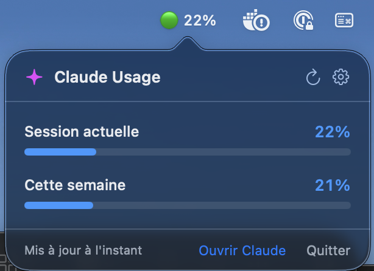

# Claude Bar

A macOS menu bar app that shows your Claude.ai usage — current session and weekly limit.

 



---

## What it does

Sits quietly in your menu bar and displays:
- **Session usage** (last 5 hours)
- **Weekly usage**

Color changes from green → orange → red as you approach limits.

---

## Requirements

- macOS 13+
- Xcode 15+
- A Claude.ai account logged in via **Safari**

---

## Setup

**1. Clone and open in Xcode**
```bash
git clone git@github.com:Murathan-Aydin/Claude-Bar.git
```
Open `claudeBar.xcodeproj`.

**2. Disable App Sandbox** (required for network access)

Xcode → target `claudeBar` → Signing & Capabilities → click **–** on App Sandbox

**3. Run**
```
⌘R
```
The icon appears in your menu bar.

---

## Usage

The app reads your session cookie automatically from Safari's shared WebKit storage.

**Safari users** — just make sure you're logged into claude.ai in Safari. That's it.

**Chrome users** — click the gear icon ⚙️ in the popover and paste your `sessionKey` cookie manually:
> Chrome → DevTools (F12) → Application → Cookies → claude.ai → `sessionKey`

---

## Install as a standalone app

```bash
cp -R ~/Library/Developer/Xcode/DerivedData/claudeBar-*/Build/Products/Debug/claudeBar.app /Applications/
```

To launch at login: System Settings → General → Login Items → add `claudeBar.app`

---

## Troubleshooting

**Percentages stuck at 0%** — Claude's internal API may have changed. Check Network tab in Safari Web Inspector on claude.ai and update the keys in `AppDelegate.swift`.

**Popover doesn't open** — Make sure App Sandbox is disabled.

---

---

# Claude Bar — Français

Une app macOS qui affiche ton taux d'utilisation Claude.ai dans la barre de menu.

---

## Ce que ça fait

Affiche en temps réel :
- **Session actuelle** (les 5 dernières heures)
- **Cette semaine**

La couleur passe de vert → orange → rouge selon l'utilisation.

---

## Prérequis

- macOS 13+
- Xcode 15+
- Un compte Claude.ai connecté via **Safari**

---

## Installation

**1. Cloner et ouvrir dans Xcode**
```bash
git clone git@github.com:Murathan-Aydin/Claude-Bar.git
```
Ouvre `claudeBar.xcodeproj`.

**2. Désactiver le Sandbox** (obligatoire pour l'accès réseau)

Xcode → target `claudeBar` → Signing & Capabilities → cliquer **–** sur App Sandbox

**3. Lancer**
```
⌘R
```
L'icône apparaît dans ta barre de menu.

---

## Utilisation

L'app lit ton cookie de session automatiquement via le WebKit partagé avec Safari.

**Utilisateurs Safari** — connecte-toi à claude.ai dans Safari, c'est tout.

**Utilisateurs Chrome** — clique sur l'icône ⚙️ dans le popover et colle manuellement le cookie `sessionKey` :
> Chrome → DevTools (F12) → Application → Cookies → claude.ai → `sessionKey`

---

## Installer comme une app classique

```bash
cp -R ~/Library/Developer/Xcode/DerivedData/claudeBar-*/Build/Products/Debug/claudeBar.app /Applications/
```

Pour lancer au démarrage : Préférences Système → Général → Éléments de connexion → ajoute `claudeBar.app`

---

## Dépannage

**Les pourcentages restent à 0%** — l'API interne de Claude a peut-être changé. Vérifie l'onglet Réseau dans l'inspecteur Safari sur claude.ai et mets à jour les clés dans `AppDelegate.swift`.

**Le popover ne s'ouvre pas** — vérifie que le App Sandbox est bien désactivé.
